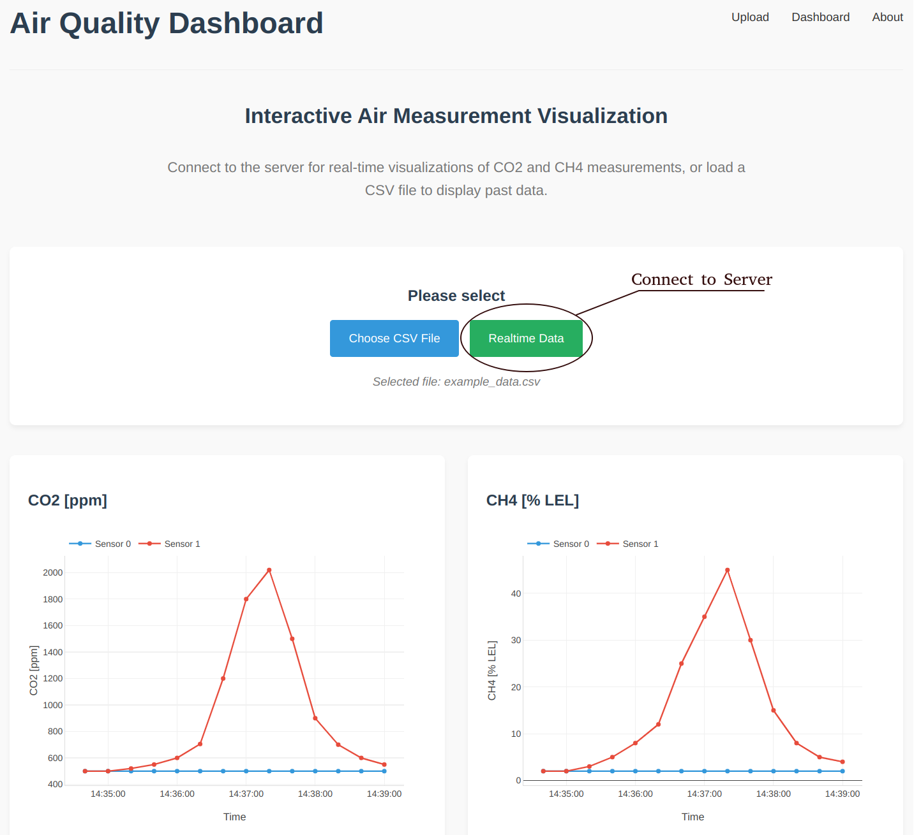

# air-observation-system

... under construction ...

An Arduino-based air quality monitoring system for gas detection. Since my apartment uses gas for water heating and cooking, this project tracks CO2 and CH4 concentration levels for both statistical analysis and safety purposes.

## How to run

### 1) Connect MCU
This project is based on the **STM32F334 Nucleo Board** and utilizes the **Arduino** Framework. **MQ135** gas sensors are used for measuring CO2 and **MQ2** sensors for measuring CH4 (methane). In my case I'm using two sensor pairs (one installed in the bathroom and one in the kitchen). However, you can add as many sensors as you need. Additionally I'm using an **Adafruit NeoPixel** for showing the current CO2 level (normal, high, critical) and a **3641AS** seven segment display for outputting the current CO2 value. The seven segment display is limited to 4 digits. Accordingly, I'm using buttons to switch between the sensor pairs.

A circuit schematic showing how to connect the components will follow soon.

In the current state I'm using the onboard ADCs for reading the sensor values. However, since the sensors are placed far from the board, this introduces some measurement inaccuracies. As next step I'm planning to add an external ADC to each sensor pair, enabling digital data transmission instead of relaying on analog signals.

MQ-series sensors require proper preheating and calibration before reliable use. Extensive documentation on this sensor family is available online for reference.


### 2) Start Server
You can start the server as following:

```Bash
python3 src/server/main.py
```

By default the server is hosted at port `8000`. The server receives the serial data sent by the MCU, stores it in an CSV-File and provides an HTTP-Endpoint forwarding the measurement data as Server Sent Events.


### 3) Open Dashboard

When the server is running, press `Realtime Data` to display the data sent by the server. Alternatively by pressing `Choose CSV File` you can display past data.


